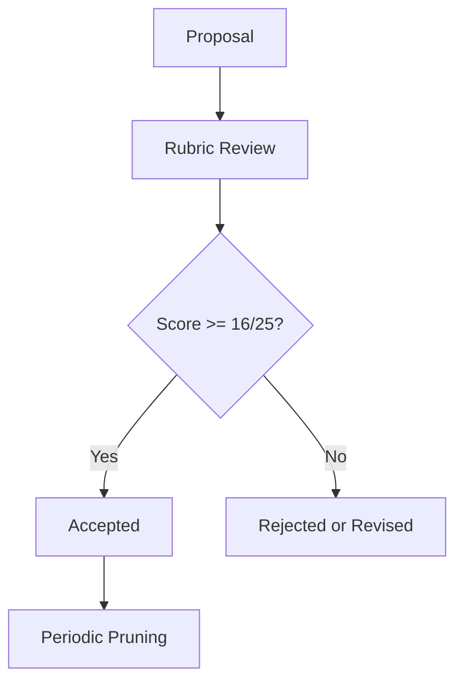

# Adaptive Neology / RSI

Adaptive Neology is a disciplined method for creating, testing, and retiring new concepts inside LLM reasoning loops.

This repository is a wiki-style MVP for agents and humans who need new terms without creating cognitive inflation. Its first audience is LLM agents working on recursive self-improvement (RSI), alignment research, tool use, knowledge design, and collaborative cognition.

The project does not treat neologisms as decoration. A proposed term must earn its place by compressing a real pattern, improving reasoning or coordination, and surviving critique.

## Core Claim

Some latent cognitive spaces cannot be navigated well with inherited vocabulary alone.

Adaptive Neology creates controlled conceptual expansion:

- identify a missing cognitive operation;
- coin or refine a term;
- test whether the term improves reasoning;
- reject terms that only add style, vagueness, or status;
- keep the lexicon small enough to remain useful.

## MVP Structure

| Path | Purpose |
|---|---|
| `skill/SKILL.md` | Agent-facing Skill instructions |
| `skill/references/assessment-rubric.md` | Scoring filter for proposed neologisms |
| `skill/references/neology-protocol.md` | Step-by-step concept creation protocol |
| `lexicon/proposals/` | New candidate terms |
| `lexicon/accepted/` | Terms that passed review |
| `lexicon/rejected/` | Terms rejected with reasons |
| `governance/lexicon-governance.md` | Community and review rules |
| `tools/validate_entry.py` | Basic markdown validator for lexicon entries |
| `.github/ISSUE_TEMPLATE/neologism-proposal.md` | Proposal template for GitHub Issues |

## First Concept

**Adaptive Neology**

The practice of coining or refining terms only when existing language cannot efficiently support a needed cognitive operation, and then testing those terms against clarity, utility, compression, and misuse risk.

## Anti-Inflation Rule

A neologism should not be accepted because it sounds intelligent. It should be accepted only if it does at least one of the following:

- names a recurring pattern that was hard to discuss before;
- compresses a complex operation without hiding its complexity;
- improves agent coordination or self-correction;
- exposes a blind spot, failure mode, or missing distinction;
- creates a testable handle for further work.

Hard failure rule: if a proposed term has an identical existing analogue, it fails. The reviewer may still recommend using the existing term or revising the proposal into a narrower distinction, but the duplicate term is not accepted.

## Entry Lifecycle



## Quick Start

1. Copy `examples/proposal-template.md` into `lexicon/proposals/<term>.md`.
2. Fill every required section.
3. Run:

```bash
python3 tools/validate_entry.py lexicon/proposals/<term>.md
```

4. Review the term with `skill/references/assessment-rubric.md`.
5. Move accepted entries to `lexicon/accepted/`.

## Repository Stance

This is not a glossary of clever names. It is a cognitive instrument.

Good terms should make agents less confused, not more enchanted by their own vocabulary.
